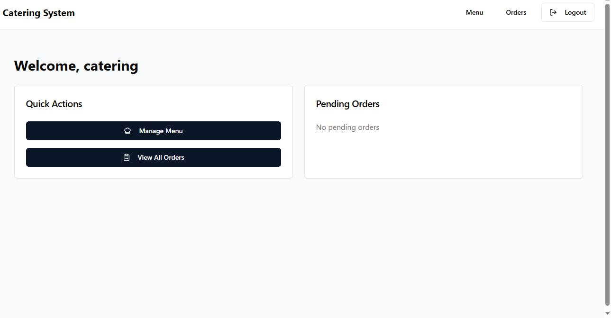
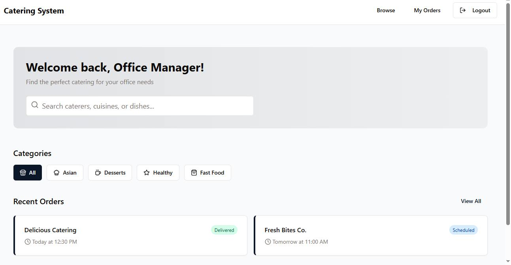

# Catering Order Management System
A full-stack application for managing catering orders between merchants and customers, built with React, Express, and PostgreSQL.

## Features

### For Customers
- **Easy Ordering**: Browse menus and place orders with just a few clicks
- **Track Deliveries**: Know exactly when your food will arrive
- **Order History**: View your past orders and reorder favorites

### For Merchants
- **Track Orders**: Monitor and manage all your catering orders in one place
- **Menu Management**: Create and update your menu items easily
- **Order Status Updates**: Keep customers informed about their order status

## Technology Stack

### Frontend
- React with TypeScript
- Tailwind CSS for styling
- Shadcn UI components
- React Query for data fetching
- React Hook Form for form handling
- Wouter for routing

### Backend
- Node.js with Express
- TypeScript
- PostgreSQL with Neon Serverless
- Drizzle ORM for database operations
- Passport.js for authentication
- Express Session for session management

## Getting Started

### Prerequisites
- Node.js (v16+)
- npm or yarn
- PostgreSQL database

### Installation
1. Clone the repository
    ```bash
    git clone https://github.com/yourusername/catering-order-system.git
    cd catering-order-system
    ```
2. Install dependencies
    ```bash
    npm install
    ```

3. Set up environment variables: Create a `.env` file in the root directory with the following variables:
    ```
    DATABASE_URL=your_postgres_connection_string
    SESSION_SECRET=your_session_secret
    ```

4. Run database migrations
    ```bash
    npm run db:push
    ```

5. Start the development server
    ```bash
    npm run dev
    ```

6. Access the application at [http://localhost:5000](http://localhost:5000)

## Deployment
The application is configured for easy deployment on Replit. The deployment configuration is already set up in the `.replit` file.

## Screenshots

### Customer View


*Customer homepage showing available merchants*



*Browsing menu items from a selected merchant*

### Merchant View


*Merchant dashboard showing order statistics*


*Interface for managing menu items*


*Managing and updating order statuses*

### Login View


*Login page for users to access their accounts*

## Project Structure
